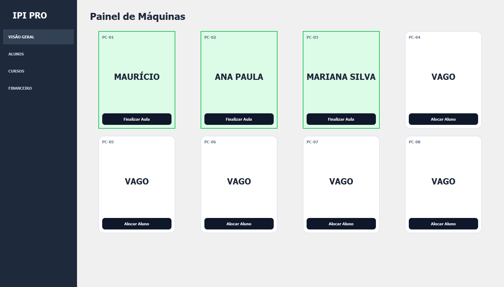

# IPI PRO - Gestão de Sala de Informática 🖥️

O **IPI PRO** é um sistema desktop desenvolvido para otimizar o gerenciamento de alunos e máquinas em salas de aula de informática. O foco do projeto é oferecer uma interface intuitiva para que o instrutor visualize, em tempo real, a ocupação do laboratório.

Este projeto faz parte do meu portfólio de transição de carreira para **Análise e Desenvolvimento de Sistemas (ADS)**.

## 🚀 Funcionalidades Atuais

- **Dashboard Visual:** Cards interativos que representam as máquinas com troca de cores por status (Vago/Ocupado).
- **Trava de Duplicidade:** Lógica que impede a alocação do mesmo aluno em múltiplas máquinas simultaneamente.
- **Persistência de Dados:** Integração com SQLite para manter o estado das alocações mesmo após o fechamento do software.
- **Seleção Inteligente:** Janela customizada com abas para separar alunos da turma atual de exceções/reposições.

## 🛠️ Tecnologias Utilizadas

- **Python 3.10+**: Linguagem base do projeto.
- **PyQt5**: Framework para a interface gráfica (GUI).
- **SQLite**: Banco de Dados relacional para armazenamento local.
- **Git/GitHub**: Controle de versionamento e gerenciamento de histórico.

## 📂 Estrutura do Projeto

```text
src/
├── database/     # Conexão e Repositórios (CRUD)
├── ui/           # Telas e Componentes visuais
│   ├── windows/  # Janelas principais
│   └── components/ # Peças reutilizáveis (Cards, Diálogos)
└── data/         # Arquivo do banco de dados (.db)
